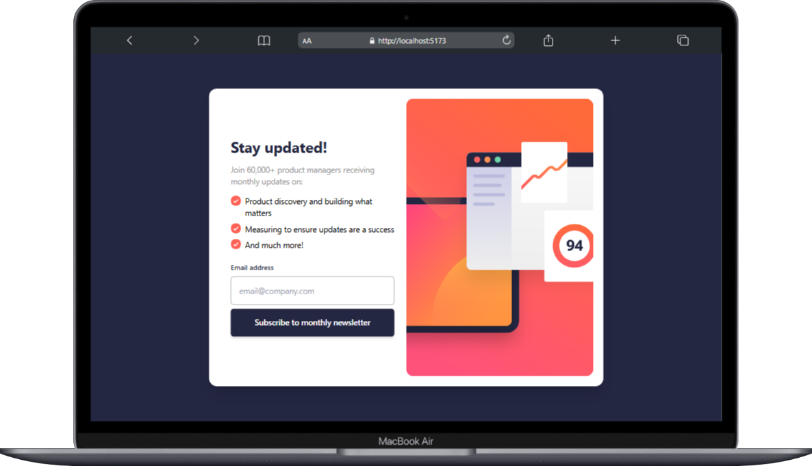
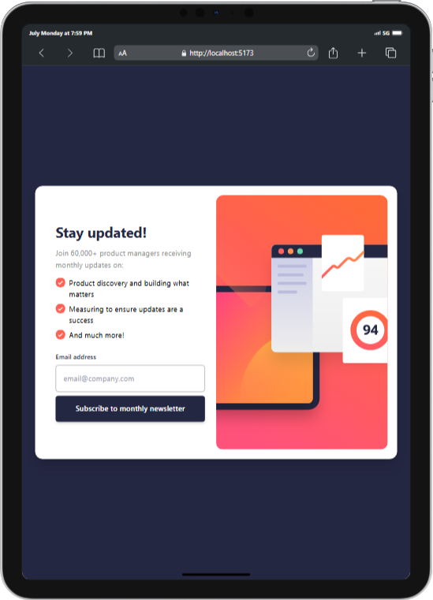
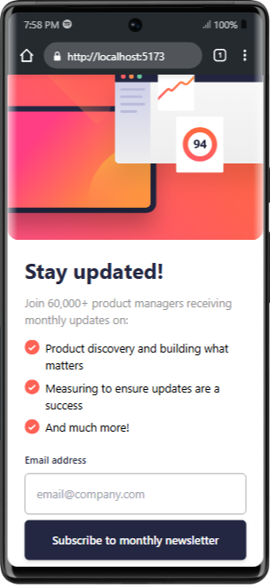
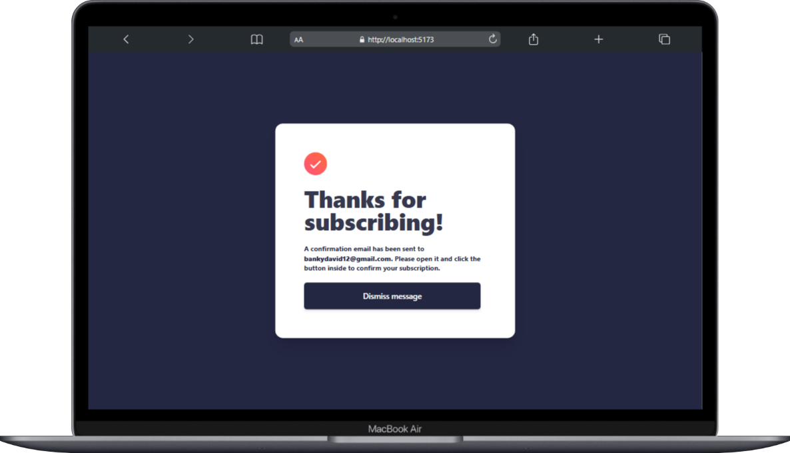
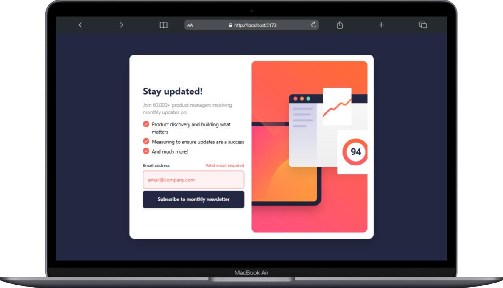

# 📩 Newsletter Sign-Up Form with Success Message

A responsive and accessible newsletter sign-up component built with **React**, **Vite**, and **Tailwind CSS** inspired by the [Frontend Mentor challenge](https://www.frontendmentor.io/challenges/newsletter-signup-form-with-success-message-Mybc6snc42).

<div align="center">


</div>

---
 [Site Preview](https://newsletter-sign-up-page-ola.vercel.app/)
---

---

---



---

## ✨ Features

- ✅ Fully responsive design (mobile & desktop)
- ⚠️ Custom input validation with error states
- 📬 Success state message with email confirmation
- 🧑‍💻 Built with React + Vite + Tailwind CSS
- ♿️ Accessible & semantic HTML structure
- 💨 Fast build and dev environment with Vite

---

## 🚀 Technologies Used

- [React](https://reactjs.org/)
- [Vite](https://vitejs.dev/)
- [Tailwind CSS](https://tailwindcss.com/)
- [ESLint](https://eslint.org/) + optional Prettier

---

## 📁 Folder Structure

```

.
├── public/
├── src/
│   ├── components/
│   │   ├── EmailForm.jsx
│   │   ├── NewsletterCard.jsx
│   │   └── SuccessCard.jsx
│   ├── App.jsx
│   └── main.jsx
├── design/               # 🔒 Ignored from Git
├── .gitignore
├── index.html
├── tailwind.config.js
├── postcss.config.js
└── README.md

````

---

## 🛠️ Getting Started

### 1. Clone the repository

```bash
git clone https://github.com/your-username/newsletter-signup.git
cd newsletter-signup
````

### 2. Install dependencies

```bash
npm install
```

### 3. Start the dev server

```bash
npm run dev
```

### 4. Build for production

```bash
npm run build
```

---

## 🧪 Design States

### ✅ Success State (Desktop)



### ❌ Error State



---

## 🙈 Git Ignore

Design files like `.jpg`, `.png`, and the entire `/design` folder are excluded from version control via `.gitignore`.

```gitignore
design/
*.jpg
*.png
```

---

## 📬 License

This project is licensed under the **MIT License**.

---

## 💡 Credits

* Challenge: [Frontend Mentor](https://www.frontendmentor.io/)
* Dev: [@dev\_olabanks](https://x.com/dev_olabanks)
* Illustrations: Provided by Frontend Mentor

---

> Built with 💙 by [@dev\_olabanks](https://x.com/dev_olabanks)

```

